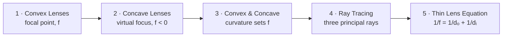
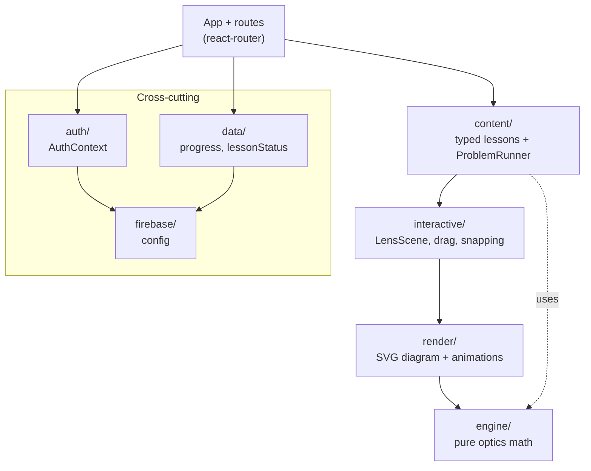

# Product Requirements Document — "LensLab"

A learn-by-doing app, built deep for one subject: **geometric optics (lenses)**.

- **Subject (per `spec.txt`):** Geometric optics — thin lenses and image formation.
- **Status:** MVP product spec (Phase 1), updated to match the current implementation.
- **Last updated:** 2026-06-24
- **Tech stack:** React 19 + TypeScript (Vite), React Router, Firebase (Auth, Firestore, Hosting).

---

## 1. Summary

LensLab teaches a single, coherent chapter — **how lenses form images** — through short, hands-on lessons. Instead of static diagrams or exam-drill problem sets, every step gives the learner a **visual simulation they manipulate directly** (drag the candle along the axis, reshape the lens with a curvature slider, draw principal rays, and watch the thin-lens equation update) and returns **instant, specific feedback** with a short explanation. Progress is **persisted per account** so a learner can leave mid-lesson and resume on any device, and a lightweight **habit loop** (daily streak, milestone badges, lesson-completion celebration, chapter progress) keeps them coming back.

Per the project's three-phase cadence, this document specifies **Phase 1 (MVP)**, which **contains no AI**: all feedback is computed deterministically from a pure physics engine and per-step rules. AI (Phase 2) and learning-science layering (Phase 3) are noted as explicit future work in §17.

---

## 2. Problem & motivation

Geometric optics is usually taught with **static diagrams**. Learners memorize the thin-lens equation and the "real vs. virtual image" rules without building intuition, because they never *move the object and watch the image respond*. Misconceptions ("a diverging lens can make a real image," "a flatter lens focuses the same") survive because nothing lets students test them.

LensLab fixes this with manipulable simulations and immediate, specific feedback — **active visual exploration instead of passive reading**. It is useful for exam study because it builds the underlying mental model, but it is not positioned as a complete exam-prep product: there is no broad drill bank, grading workflow, or coverage of every possible AP/college optics question.

---

## 3. Spec alignment — the three phases

`spec.txt` mandates a strict build order. This PRD covers Phase 1 only; later phases are deliberately out of scope here (see §17).

| Phase | Deadline | What it adds | This PRD |
|-------|----------|--------------|----------|
| **1 — MVP** | "Wednesday" | The core learn-by-doing app. **No AI.** | ✅ Specified here |
| **2 — AI** | "Friday" | AI does something genuinely useful (e.g., generated hints, free-form Q&A, lesson generation from the content model). | ⏳ Future (§17) |
| **3 — Learning science** | "Sunday" | Evidence-based techniques (spacing, retrieval practice, deeper mastery modeling). | ⏳ Future (§17) |

The rule behind the order: *if the app does not teach without AI, no AI will save it.* LensLab is therefore designed so the unaided experience already teaches.

---

## 4. User persona & domain

### Primary persona (niche, MVP focus)

**The algebra-ready visual learner.**

- Has enough algebra to follow relationships like `1/f = 1/d_o + 1/d_i` and `m = -d_i/d_o`.
- Wants to build **intuition for concave and convex lenses** by seeing and manipulating the ray diagram, not just memorizing a rules table.
- May be taking physics or studying for an exam, but the main job-to-be-done is "help me see why this happens."
- Uses a **laptop or tablet/phone** to drag objects, reshape lenses, and construct ray diagrams.
- Frustrated by static textbook diagrams and answer keys that say *what* is right but not *why*.
- Appreciates progress, streaks, and milestones, but is primarily motivated by the moment when the diagram "clicks."

### User story (primary)

> **As an** algebra-capable learner, **I want to** manipulate concave and convex lens diagrams and get instant feedback on what I tried, **so that** I can build visual intuition for image formation before applying equations or exam-style shortcuts.

### Domain scope (the "chapter")

**Geometric optics — thin lenses and image formation**, mapped as a **five-lesson learning path** (§6–§7) that takes a learner from "what is a focal point" to "predict any image with the thin lens equation."

### Personas explicitly NOT targeted (MVP)

- Optical engineers needing aberration modeling, glass catalogs, or precision tolerances.
- People without an algebra background.
- General "all of physics" learners — we stay niche to lenses.
- Instructors needing a classroom dashboard, assignment management, or grading exports.

---

## 5. MVP definition & acceptance criteria

The MVP is the **smallest product that lets a learner complete a real, multi-lesson optics course with manipulable problems, instant feedback, persistent progress, and a sense of daily momentum — on phone or laptop.**

A build is "MVP-complete" when all of `spec.txt`'s Phase-1 gates hold:

1. A **chosen subject**, stated clearly, with the whole app built for a specific persona. ✅ (Lenses; algebra-ready visual learner.)
2. **Interactive lessons on real concepts**, built around hands-on problems — not videos or walls of text. ✅ (Five lessons; see §7.)
3. **At least one** problem the learner manipulates directly (drag, slider, predict). ✅ (Every interactive step.)
4. A **visual element that responds** to input. ✅ (Live SVG ray diagram.)
5. **Instant, specific, hand-written feedback** on each answer, right or wrong, with a short explanation and a hint on a wrong attempt. ✅
6. **Progress persists**: leave mid-lesson, come back (even on another device), resume the same step. ✅ (Firestore.)
7. **Accounts and names** (auth). ✅ (Email/password + Google.)
8. **Works on mobile** screen sizes with touch. ✅ (Responsive SVG + layout.)
9. **Deployed and public.** ✅ (Firebase Hosting.)

### Performance targets (from `spec.txt`)

- Feedback on an answer appears **under 100 ms** (computed locally; no network round-trip to validate).
- Interactive visuals stay **smooth (~60 FPS)** while dragging.
- Lessons reach first interaction in **under 2 s**.
- **Multiple concurrent learners** with no slowdown (static hosting + per-user docs).

### The five MVP testing scenarios (from `spec.txt`)

1. A learner completes **one lesson end to end**, gets some problems wrong, and uses the feedback to recover.
2. A learner **manipulates the interactive element** and watches the visual respond in real time.
3. A learner **leaves mid-lesson and returns**; progress and streak persist.
4. A learner **finishes a lesson** and the path **recommends a sensible next step**.
5. The whole thing **on a phone-sized screen**.

---

## 6. Course path & depth over breadth

Per `spec.txt`'s "depth over breadth" rule, LensLab ships **five lessons that build on each other**, not a shallow tour. Each unlocks the next; a learner who starts knowing little comes out able to predict any thin-lens image.



Lessons unlock **sequentially**: lesson *n* opens once lesson *n−1* is completed (`deriveChapterStatus` in `src/data/lessonStatus.ts`). The home screen recommends the first unlocked, unfinished lesson.

---

## 7. Lesson plan

### 7.1 Overview

| # | Lesson | id | Core interaction | Concept |
|---|--------|-----|------------------|---------|
| 1 | **Convex Lenses** | `focusing-light` | Drag the candle to create target image types | Converging lens, **real/virtual**, **upright/inverted**, focal point **F** |
| 2 | **Concave Lenses** | `concave-lenses` | Drag and choose what can/cannot be made | Diverging lens, **f < 0**, always virtual/upright/reduced for real objects |
| 3 | **Convex & Concave Lenses** | `convex-concave` | A **continuous, logarithmic curvature slider** reshapes the lens | Shape sets the **sign and strength** of f (convex / flat / concave) |
| 4 | **Ray Tracing** | `ray-tracing` | **Draw the three principal rays** by dragging ray endpoints | The **parallel**, **chief**, and **focal** rays locate any image |
| 5 | **The Thin Lens Equation** | `thin-lens-equation` | Drag to target equation/diagram outcomes | \( \tfrac{1}{f} = \tfrac{1}{d_o} + \tfrac{1}{d_i} \), \( m = -\tfrac{d_i}{d_o} \) |

Every lesson opens with a short, mostly-visual **intro** (heading + a few sentences + an optional animated explainer) and then a handful of interactive/predict steps.

### 7.2 Per-lesson breakdown

**Lesson 1 — Convex Lenses (`focusing-light`).**
*Intro:* a flat slab morphs into a convex lens while parallel rays bend to meet at **F** (`ConvexLensAnimation`).
*Steps:* (a) make a **real** image; (b) make a **virtual** image; (c) make an **upright** image; (d) make an **inverted** image. The learner finds the correct candle ranges by observing whether solid outgoing rays meet on the opposite side of the lens from the object, or dotted back-traces meet on the same side as the object.
*Teaches:* a convex lens changes behavior across **F**: outside **F** gives real/inverted images; inside **F** gives virtual/upright images.

**Lesson 2 — Concave Lenses (`concave-lenses`).**
*Intro:* a slab morphs into a concave lens while parallel rays diverge and their dashed back-extensions meet at the **virtual focus** (`ConcaveLensAnimation`).
*Steps:* (a) make a **virtual** image; (b) make an **upright** image; (c) try to make a **real** image and discover it cannot be made with a real object; (d) try to make an **inverted** image and discover it cannot be made with a real object.
*Teaches:* a diverging lens always forms a virtual, upright, reduced image for a real object; real/inverted outcomes belong to convex-lens ranges, not concave-lens ranges.

**Lesson 3 — Convex & Concave Lenses (`convex-concave`).**
*Core interaction:* a **continuous, logarithmic curvature slider** reshapes one lens; the runner derives the focal length from its position (`sliderToFocalLength`), and the readout names the result ("Convex · f = …" / "Concave · f = …" / "Flat"). The readout says **Flat** only at the exact center position (`p = 0`).
*Steps:* (a) curve it outward to make it **converging** (f > 0); (b) curve it the other way to make it **diverging** (f < 0); (c) flatten it exactly at the center (f → ∞, no focusing). The intro animation moves concave → flat → convex, and the diagram redraws the lens as convex / flat / concave to match.
*Teaches:* lens shape sets the sign and strength of f; a flat lens has no focal point.

**Lesson 4 — Ray Tracing (`ray-tracing`).**
*Intro:* the three principal rays animation.
*Steps:* four draw-the-rays scenes: convex beyond **2F**, convex between **F** and **2F**, concave near, and concave far. In each scene the learner selects a ray type and drags its endpoint until the live checklist marks that ray's rule Done. Handles are color-coded by ray: parallel, chief, and focal.
*Teaches:* you only need three special rays to locate any image; each rule is physically different and the hint names the currently unmet ray requirement.

**Lesson 5 — The Thin Lens Equation (`thin-lens-equation`).**
*Intro:* light fanning from a source back to an image through F (`RaySourceAnimation`); the equation shown live.
*Steps:* make a convex **virtual magnifier**, make a convex **projector** image, use a concave lens for a less-reduced upright image close to object size (including the `d_o = 0` boundary case), and use a concave lens to make a tiny virtual image near **F**. A **live equation panel** plugs in the current numbers; `f`, `d_o`, and `d_i` are shown by default, while magnification/heights are off by default.
*Teaches:* one equation ties object distance, image distance, and magnification together while preserving the visual interpretation from earlier lessons.

---

## 8. In scope vs. out of scope (MVP)

### In scope

- Email/password **and** Google authentication, with a display name and account management (change name/email/password, account linking).
- A **content model** (typed lesson/step definitions) so new lessons are added as data, not new code.
- A **shared optics engine** (pure functions) powering all simulations and success checks.
- Interactive problem types: **drag-along-axis** (with snapping + drag-to-infinity), **slider**, **continuous/logarithmic curvature**, **predict-then-reveal** (which can stay interactive via a post-commit drag), and **draw-the-rays** (construct the ray diagram by dragging each principal ray endpoint).
- Deterministic, rule-based feedback (correct/incorrect + explanation + a hint).
- Per-user progress: current lesson, current step (resume), completed lessons; daily streak.
- **Client-side routing** with deep links and working browser back/forward (`/login`, `/`, `/topics/:topicId`, `/lessons/:lessonId`).
- Responsive layout (mobile + desktop, resizes with the window).
- Firebase Hosting deployment.

> **Update (post-MVP):** A **Practice mode** with a global **leaderboard** has since
> been added on top of the MVP. It is documented in §21 and intentionally goes
> beyond the original MVP scope below (which listed leaderboards and adaptive
> practice as deferred). It still uses **no AI** — practice problems are generated
> from deterministic, hand-authored templates.

### Out of scope (MVP — deferred)

- **Any AI/LLM features** (no model calls, no generated hints, no chatbot) — Phase 2.
- Authoring UI / CMS (content is edited as typed config).
- Social features: following, leaderboards, sharing, comments.
- Spaced repetition and adaptive mastery modeling — a *simple* "what's next" rule is allowed (Phase 3 deepens this).
- Payments, subscriptions, paywalls.
- Multi-subject catalog (only the lenses chapter exists).
- Offline/PWA, push notifications, native apps.
- Instructor dashboards, classes, assignments.
- Internationalization; full WCAG audit (we keep semantics sane).

### User stories NOT focused on (MVP)

- *As an instructor, I want to assign lessons and see class scores* — out.
- *As a learner, I want an AI tutor for free-form questions* — out (Phase 2).
- *As a learner, I want a global leaderboard* — out.
- *As a power user, I want to author lessons in-app* — out.
- *As a learner, I want spaced-repetition scheduling* — out (Phase 3).

---

## 9. Functional requirements

### 9.1 Authentication & accounts
- FR-1: Sign up with email/password (with a display name) or Google.
- FR-2: Stay signed in across sessions (persisted auth).
- FR-3: Sign out (behind a confirmation dialog).
- FR-4: Manage the account: change display name, change email (re-auth required), change password, link a same-email Google/password credential, and save appearance preferences (avatar + background). Creating an email account that collides with an existing Google login is blocked with a helpful message.
- FR-5: Routes are auth-gated: unauthenticated users are sent to `/login`.

### 9.2 Lessons & interactive steps
- FR-6: The home screen lists the five lessons with locked/unlocked/completed state and chapter progress.
- FR-7: A lesson is an ordered sequence of steps; each renders a prompt + a live diagram + controls (or predict choices, or draggable ray endpoints for draw-the-rays steps).
- FR-8: Interactive steps validate the manipulation against a `success` rule and show **instant** correct/incorrect feedback.
- FR-9: A wrong attempt shows a **specific** hint, not just "incorrect."
- FR-10: Predict-then-reveal steps hide the rays/image until the learner commits, then reveal both with an explanation; an optional `explore` control then lets the learner drag the object and watch the revealed result respond.
- FR-11: On lesson completion, a celebratory summary appears.

### 9.3 Progress & persistence
- FR-12: The app records current lesson and current step index to Firestore as the learner advances.
- FR-13: A learner who exits mid-lesson resumes at the same step on any device after sign-in.
- FR-14: Completed lessons are marked and contribute to chapter progress and lesson unlocking.

### 9.4 Habit loop
- FR-15: A daily streak increments once per local day on lesson completion and resets after a missed day.
- FR-16: Chapter progress (e.g., "2 / 5 lessons") is visible on the home screen.
- FR-16a: **Milestone badges** (first lesson, halfway, course complete, 2-day streak, 7-day streak) are derived client-side from progress and streak data and shown on the home screen; a newly earned milestone triggers a small celebration.

### 9.5 Responsiveness & navigation
- FR-17: Layouts adapt from ~320 px to desktop; the SVG diagram scales with the viewport and works with touch and mouse.
- FR-18: Deep links and the browser back/forward buttons work for every screen.

---

## 10. Non-functional requirements

- **Performance:** synchronous, cheap engine functions; SVG animations driven by `requestAnimationFrame`; feedback computed locally (< 100 ms).
- **Reliability:** feedback is deterministic and reproducible; the engine never throws or returns `NaN` on edge cases (object at 0/∞, flat lens at f = ∞).
- **Cost:** stays within Firebase Spark-tier limits for MVP traffic.
- **Maintainability:** the engine has zero React/DOM dependencies and is unit-tested; new lessons are pure content config.
- **Security:** Firestore rules restrict each user to their own `users/{uid}` documents.
- **Accessibility:** semantic roles (`slider`, `radiogroup`, `progressbar`), `aria-label`s on the diagram, and `prefers-reduced-motion` support on animations.

### 10.1 Interactive-problem design principles (learning science)

- **Visual-first, minimal text.** Carry meaning with the diagram, color, and motion; keep prompts/feedback to a sentence or two.
- **Dual coding.** Each symbol (`f`/`dₒ`/`dᵢ`/`m`) uses one consistent color across the equation, the readout chips, and the diagram.
- **Show the actual concept.** The thin lens equation is on screen and updates live; the curvature lesson reshapes the lens; ray tracing is drawn by the learner rather than merely inspected.
- **Explain terms before using them.** Vocabulary (real/virtual, inverted, focal length) is introduced visually and via an on-demand glossary.
- **Active recall + specific feedback.** The learner manipulates something to answer; feedback says *why*. Predict-then-reveal forces a commitment first.
- **Color and imagery.** A coherent palette and a real-looking candle make scenes memorable.

---

## 11. Architecture overview

Decoupled layers; dependencies point toward the pure engine (which depends on nothing).



| Layer | Responsibility | Examples |
|-------|----------------|----------|
| **engine/** | Pure optics math, no React | `imageDistance`, `magnification`, `formImage`, `tracePrincipalRays`, `sliderToFocalLength` |
| **render/** | Draw visuals from computed props | `LensDiagram`, `ConvexLensAnimation`, `ConcaveLensAnimation`, `RayFocusAnimation` |
| **interactive/** | State + input wiring | `LensScene`, `snapValue` |
| **content/** | Typed lesson/step data + runner + rich text | `ProblemRunner`, lesson configs, `renderRich` |
| **auth/** | Auth context + friendly error mapping | `AuthContext`, `friendlyAuthError` |
| **data/** | Persistence + status derivation | `progress.ts`, `lessonStatus.ts` |
| **firebase/** | SDK initialization | `config.ts` |

A generic **`ProblemRunner`** interprets any lesson definition, so adding a lesson = adding config.

---

## 12. Tech stack

- **Frontend:** React 19 + TypeScript, built with Vite. SVG for ray diagrams (resolution-independent, easy to make responsive and animate).
- **Routing:** React Router (`BrowserRouter`) for `/login`, `/`, `/topics/:topicId`, `/lessons/:lessonId`, with auth gating.
- **Styling:** CSS with variables and responsive units; no heavy UI framework.
- **Backend-as-a-service:** Firebase — **Auth** (email/password + Google), **Cloud Firestore** (profiles, streaks, per-lesson progress), **Hosting** (static SPA deploy).
- **Content storage decision (MVP):** lessons ship as **typed config in the repo** (versioned, zero read cost, easy to author). Firestore stores only **per-user data**. A future iteration can move content into a `lessons` collection without changing the content model.

---

## 13. Content model (in-app types)

The actual types live in `src/content/types.ts`:

```ts
// A control is a slider/drag/curvature input bound to one state key.
type ControlType = 'drag-axis' | 'slider' | 'curvature'

interface Control {
  key: string            // state key this control writes, e.g. "objectDistance" | "curvature"
  type: ControlType
  min: number
  max: number
  step?: number           // small steps (e.g. 0.01) make a curvature slider continuous
  label?: string
  allowInfinity?: boolean // show an "∞" button / drag-to-infinity
  snaps?: number[]        // gently snap to important values (0, f, 2f, …)
}

// Three kinds of step: a hands-on interactive step, a predict-then-reveal step,
// or a plot-the-rays step (construct the ray diagram by dragging ray endpoints).
interface InteractiveStep {
  id: string
  prompt: string
  kind?: 'interactive'
  controls: Control[]
  initial: Record<string, number>          // starting control values
  fixed?: Record<string, number>           // values the learner can't change
  success: (state, image: ImageFormation) => boolean
  correctFeedback: string
  hint: string
}

interface Choice { id: string; label: string; correct?: boolean; feedback: string }

interface PredictStep {
  id: string
  prompt: string
  kind: 'predict'
  scene: { objectDistance: number; focalLength: number }
  choices: Choice[]                        // exactly one correct
  reveal: string                           // shown once the truth is revealed
  explore?: Control                        // after committing, drag to keep it hands-on
}

interface PlotRaysStep {
  id: string
  prompt: string
  kind: 'plot-rays'
  scene: { objectDistance: number; focalLength: number; objectHeight?: number }
  reveal: string                           // shown once the rays converge correctly
  hint?: string                            // nudge shown while still solving
}

type StepDefinition = InteractiveStep | PredictStep | PlotRaysStep

interface LessonIntro {
  heading: string
  paragraphs: string[]
  animation?: 'focus' | 'source' | 'convex' | 'concave' | 'curvature'
}

interface LessonDefinition {
  id: string
  title: string
  order: number
  estMinutes: number
  summary?: string
  placeholder?: boolean    // a "coming soon" card (none in the current course)
  intro?: LessonIntro
  steps: StepDefinition[]
}
```

**Curvature control.** Lesson 3's curvature slider is **continuous** (a position `p ∈ [-1, 1]`, step `0.01`); `ProblemRunner` maps it to a focal length via `sliderToFocalLength(p)` using a **logarithmic** interpolation, so equal slider movement multiplies `f` by a constant factor and the lens flattens smoothly toward an **infinite** focal length at the center (`p > 0` convex, `p < 0` concave, `p = 0` → `Infinity`). The engine keeps its `f`-based API and never divides by zero. The UI readout says "Flat" only at the exact center; otherwise even weakly curved lenses are labeled convex or concave with a focal length.

**Interactive predict steps.** A predict-then-reveal step may carry an optional `explore` control: once the learner commits, a drag handle activates so they can move the object and watch the now-revealed rays and image respond. This keeps the single predict step per lesson hands-on rather than a static multiple-choice.

**Draw-the-rays steps.** Instead of choosing an answer, the learner selects the **parallel**, **chief**, or **focal** ray and drags that ray's colored endpoint until its rule is satisfied. A live checklist lights up as each rule is met — **parallel** bends through F (or back-traces to virtual F), **chief** stays straight through the center, **focal** exits parallel. Initial endpoints are deliberately off-rule, so no requirement starts complete by default. The geometry rules are pure and unit-tested (`src/interactive/plotRays.ts`), while the interaction lives in `DrawRaysScene`.

**Rich text.** Feedback and intro text support lightweight `**bold**`, `__underline__`, and `\frac{num}{den}` syntax, rendered by `renderRich` (`src/content/richText.tsx`).

---

## 14. Data schema

### 14.1 Where things live

| Data | Store | Rationale |
|------|-------|-----------|
| Lesson/step **content** | In-app TypeScript config (repo) | Static, versioned, zero read cost, dev-authored |
| User **profile & streak** | Firestore `users/{uid}` | Per-user, small, frequently read |
| Per-lesson **progress** | Firestore `users/{uid}/progress/{lessonId}` | Per-user, resumable |
| **Auth credentials** | Firebase Auth (managed) | Never stored in our DB |

### 14.2 Firestore layout (matches `src/data/progress.ts`)

```
users/{uid}
  ├─ displayName: string
  ├─ email: string
  ├─ createdAt: Timestamp
  ├─ streak: {
        current: number,          // consecutive active days
        longest: number,
        lastActiveDate: string    // "YYYY-MM-DD", user's local day
     }
  └─ appearance: {
        avatarId: 'initial' | 'candle' | 'lens' | 'prism' | 'rainbow' | 'star',
        backgroundId: 'aurora' | 'prism'
     }

users/{uid}/progress/{lessonId}   // one doc per lesson
  ├─ lessonId: string
  ├─ status: 'in-progress' | 'completed'
  ├─ currentStepIndex: number      // for resume
  ├─ completedAt?: Timestamp       // set on completion
  └─ updatedAt: Timestamp
```

**Example `users/{uid}/progress/concave-lenses`:**

```json
{
  "lessonId": "concave-lenses",
  "status": "in-progress",
  "currentStepIndex": 1,
  "updatedAt": "2026-06-23T13:43:00Z"
}
```

> Per-step attempt counts are intentionally **not** persisted in the MVP. **Milestone badges** need no schema change either: they are derived client-side from progress and streak data (§15), with the "already seen" set kept in `localStorage` only to decide when to celebrate.

### 14.3 Security rules (intent)

- A user may read/write only documents under their own `users/{uid}` path (`request.auth.uid == uid`).
- Content is not in Firestore (MVP), so no content read rules are needed.

---

## 15. Habit loop & "what's next" logic (lightweight, MVP)

No ML. A few simple, deterministic rules:

- **Streak:** completing a lesson bumps a daily streak once per local day (`bumpStreak`); a missed day resets it.
- **Milestones:** `deriveMilestones(status, streak)` derives badges entirely from existing progress + streak data (no extra Firestore writes): first lesson, halfway (3 lessons), course complete (5 lessons), 2-day streak, and 7-day streak. Streak badges use the **longest** streak so they stay earned after a reset. Newly earned badges trigger a small celebration (last-seen set tracked in `localStorage`).
- **Recommendation:** `deriveChapterStatus` recommends the **lowest-order unlocked, unfinished lesson**. Lessons unlock sequentially as the previous one is completed.

This satisfies "track mastery, recommend what's next" without adaptive modeling. Phase 3 can layer real spacing/retrieval on top.

---

## 16. Routing & navigation

| Route | Screen | Notes |
|-------|--------|-------|
| `/login` | Auth (sign in / sign up) | Redirects to `/` when already signed in |
| `/` | Topics landing | Auth-gated; pick a subject (today: Geometric Optics: Lenses) |
| `/topics/:topicId` | Course path / roadmap | The lessons + progress for a topic; unknown topics redirect to `/` |
| `/lessons/:lessonId` | Lesson runner | Deep-linkable; resumes the saved step; includes a one-step Back button |

Account management (name/email/password, sign-in method, linking) opens as a **modal** from the avatar on the landing or roadmap pages, rather than a separate route.

Built on React Router so deep links and the browser **back/forward** buttons work everywhere; unauthenticated access to gated routes redirects to `/login`. The lesson runner also has an in-lesson **Back** button that returns to the previous step without leaving the lesson. The view scrolls back to the top on each route change and step change.

---

## 17. Future / out of scope (kept for later phases)

These are deliberately **not** in the MVP but the door is left open:

- **More lenses content:** the **Lensmaker's Equation** (reshape glass via radii/index to hit a target *f*) and **Chromatic Aberration** (dispersion; build a doublet). The `placeholder()` helper and sequential-unlock model already accommodate new lessons.
- **Exam-prep layer:** optional drill sets, formula practice, or assessment-style questions. This would be useful for learners studying for a test, but it is intentionally separate from the MVP's visual-intuition goal.
- **Phase 2 — AI:** generated hints tuned to the learner's wrong attempt, a free-form "explain this" tutor, or generating new lessons from the content model.
- **Phase 3 — Learning science:** spaced repetition, retrieval-practice scheduling, per-step mastery tracking and "review this" prompts (which would reintroduce per-step attempt persistence in the schema).
- **Platform:** instructor dashboards, social/leaderboards, offline/PWA, i18n, full WCAG audit.

---

## 18. Success metrics (how we'd judge the MVP)

- **Activation:** % of new accounts that complete Lesson 1.
- **Completion:** % of starters who finish all five lessons.
- **Retention proxy:** % of users with a streak ≥ 2 days.
- **Resume works:** % of mid-lesson exits that resume at the right step.
- **Feedback quality (qualitative):** learners report the explanations told them *why* they were wrong.

---

## 19. Risks & open questions

- **Drag UX on mobile** for ray diagrams can be fiddly; mitigated with large hit targets, value snapping, and SVG scaling.
- **Streak timezone handling** — store the user's local "YYYY-MM-DD" as the single source of "today."
- **Scope creep into more topics** — resist; Lensmaker/Chromatic stay future-only.
- **Decided:** Auth supports **email/password + Google**, with account linking and a block on email accounts colliding with an existing Google login.
- **Decided:** Lessons **unlock sequentially**; completed lessons can be replayed.

---

## 20. Proposed build order

1. Scaffold the layers + Firebase config (auth + Firestore).
2. Build the **engine** (`imageDistance`, `magnification`, `formImage`, `tracePrincipalRays`, `sliderToFocalLength`) with unit tests.
3. Build **render** + **interactive** (`LensDiagram`, `LensScene`) and the generic **`ProblemRunner`**.
4. Ship one lesson end-to-end as a vertical slice (auth → interact → feedback → persist).
5. Add the remaining lessons as content config (Convex → Concave → Convex & Concave → Ray Tracing → Thin Lens).
6. Layer in the habit loop (streak, progress), routing, account management, and responsive polish.
7. Deploy to Firebase Hosting.
8. (Future) Lensmaker + chromatic lessons; then Phases 2–3.

---

## 21. Practice mode, mastery & leaderboard (post-MVP addition)

Layered on top of the MVP (and beyond the original scope in §8). **No AI**:
practice problems are generated from deterministic, hand-authored templates.

### 21.1 Goals

- An **endless** practice stream that reuses the lessons' interactions (drag,
  draw-the-rays, predict, curvature) rather than multiple-choice trivia.
- **Mastery tracking** that drives **repetition** of weak topics while
  **interleaving** so the same topic never repeats back-to-back.
- **Never show a question total** — practice should feel unlimited.
- A habit loop: a **correct-answer streak**, **milestones**, and a global
  **leaderboard** of all users by total correct answers.

### 21.2 How it works

- **Topics.** Six mastery topics (`src/content/practice/topics.ts`):
  `convex-images`, `concave-images`, `curvature`, `ray-tracing`, `thin-lens`,
  `sign-conventions`.
- **Templates.** Each topic owns one or more `PracticeTemplate`s whose
  `generate(rng)` returns an ordinary lesson `StepDefinition`
  (`InteractiveStep` / `PredictStep` / `PlotRaysStep`) with randomized friendly
  numbers — so a single shared renderer (`StepView`) handles both lessons and
  practice. A seeded RNG (`rng.ts`) keeps generation deterministic for tests.
- **Adaptive selection** (`select.ts`, pure + unit-tested). Each topic's weight
  is `1 + 4 · wrongRate` with a Laplace-smoothed error rate, so weak topics
  recur more and unseen topics get a moderate exploratory weight. The previous
  topic is excluded each draw to force interleaving.
- **Mastery signal.** The **first** submission per question decides the recorded
  outcome (standard retrieval-practice). Counts live in `users/{uid}.mastery`.
- **Stats & streak.** `users/{uid}.practiceStats` holds `totalAttempts`,
  `totalCorrect`, and a consecutive-correct `questionStreak`. A correct answer
  also bumps the daily learning streak.
- **Milestones.** Derived client-side (`practiceMilestones.ts`): 10/50/100
  correct and 5/10-in-a-row, celebrated via a `localStorage` "seen" set.

### 21.3 Leaderboard & data model

A single shared, public-read collection holds only a name and a score:

```
leaderboard/{uid}
  ├─ displayName: string
  ├─ totalCorrect: number
  └─ updatedAt: Timestamp
```

- **Rules:** `allow read: if request.auth != null;` (any signed-in user), but
  `create/update` only by the owner (`request.auth.uid == uid`) and validated to
  exactly `{displayName, totalCorrect, updatedAt}`. No email or other profile
  data is ever exposed. The private `users/{uid}` doc stays owner-only.
- The leaderboard entry is written in the same `writeBatch` as the practice
  stats/mastery update, and re-synced on practice entry to pick up name changes.

### 21.4 Routing & entry points

- New route `/topics/:topicId/practice` → `PracticeView`.
- Entry points: a **Practice problems** card on the roadmap and a **Practice
  problems** button on a lesson's finish screen.

## 22. AI Simulation Studio (Phase 2)

The Simulation Studio lets a learner describe a simulation in plain language and
get a live, interactive version to play with. Unlike lessons and practice (which
are deterministic and AI-free), the Studio uses AI to author the simulation, then
runs the generated code in a locked-down sandbox window.

### 22.1 How it works

- The learner types a short optics prompt (e.g. "chromatic aberration", "prism").
- A server-side OpenAI proxy (Supabase Edge Function `generate-simulation`, with
  `OPENAI_API_KEY` in Supabase secrets) runs **two** calls: it first **enriches**
  the prompt into a detailed design brief, then **generates** a single
  self-contained interactive React + TypeScript (TSX) component as
  `{ title, description, code }`.
- The app validates the result and runs it inside a responsive, mobile-friendly,
  drag-resizable / expandable sandbox window (an `allow-scripts`-only iframe whose
  CSP blocks all network access). React and Babel load from a pinned CDN; Babel
  transpiles the TypeScript + JSX and runs the component.
- The simulation is fully interactive and animated: working sliders, draggable
  elements, `requestAnimationFrame` motion, and SVG/Canvas visuals.
- On any failure the Studio shows the error; there is no canned fallback.

See `docs/AI_SIMULATION_INTERFACE.md` for the full contract and sandbox details.

### 22.2 Example prompts

- **User:** chromatic aberration simulation
  **Output:** a chromatic aberration simulation with a slider allowing you to
  adjust the intensity of the effect, and a window next to it showing how it would
  look on a screen.
- **User:** image visualizer with a candle, convex lens
  **Output:** an image-visualizer window on the right showing the displayed image,
  a screen whose distance you set with a slider, a candle whose distance you set
  with a slider, and rays to show how the light bends.

### 22.3 Learning-science rationale

The Studio is designed to support how people actually learn, not just to be a
novelty:

- **Active learning through manipulation.** Learners change parameters (sliders,
  drags) and immediately see the effect, instead of reading static text. Doing and
  observing builds intuition far better than passive review.
- **Inquiry / curiosity-driven learning.** The learner poses their own "what if?"
  question as the prompt, which raises engagement, ownership, and motivation to
  understand the answer.
- **Dual coding and multiple representations.** Simulations pair a visual model
  (rays, lenses, screens, fringing) with controls and numeric readouts, reinforcing
  the same concept across verbal, symbolic, and visual channels.
- **Variable manipulation and hypothesis testing.** Changing one variable at a
  time (intensity, object distance, focal length) helps learners isolate causes and
  build accurate causal mental models, surfacing and correcting misconceptions.
- **Immediate feedback loop.** Real-time visual response shortens the
  feedback cycle, which is strongly associated with better conceptual understanding
  and retention.
- **Lower barrier to exploration.** Generating a tailored sandbox on demand lets
  learners investigate niche ideas the fixed curriculum does not cover, extending
  curiosity beyond the lesson roadmap.

**Honest limitation.** The Studio produces an exploratory sandbox, not a graded or
guaranteed-correct physics authority. It complements — it does not replace — the
validated lessons and practice, which remain the source of truth for correctness
and progress.

### 22.4 Functional requirements

- **FR-SIM-1:** Authenticated learners can open the Studio from the topic roadmap.
- **FR-SIM-2:** A learner can submit a natural-language prompt and receive an
  interactive generated simulation, or a clear error.
- **FR-SIM-3:** The OpenAI key is never exposed client-side; generation happens only
  through the Supabase Edge Function.
- **FR-SIM-4:** Generated code runs only inside a sandboxed, network-blocked iframe;
  it cannot access the app origin, cookies, storage, or the network.
- **FR-SIM-5:** Server and client both reject code that uses forbidden capabilities
  (network, storage, cookies, frame escape) before it renders.
- **FR-SIM-6:** The simulation window is fixed-size, responsive, and mobile friendly.
- **FR-SIM-7:** The Studio is sandbox-only and does not affect lessons, practice,
  mastery, streaks, or the leaderboard.

### 22.5 Routing & entry points

- New route `/topics/:topicId/studio` → `SimulationStudio`.
- Entry point: an **AI Simulation Studio** card on the topic roadmap.
